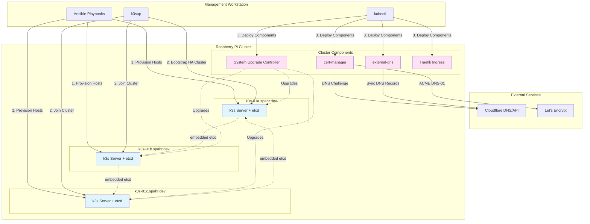
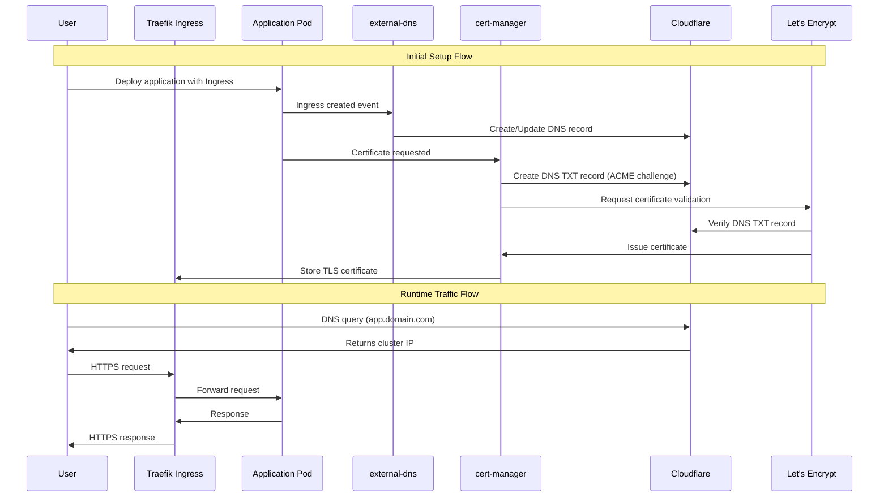
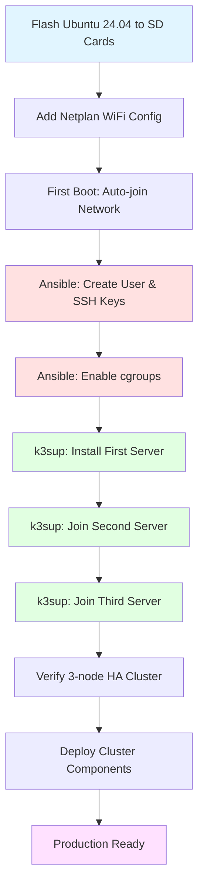
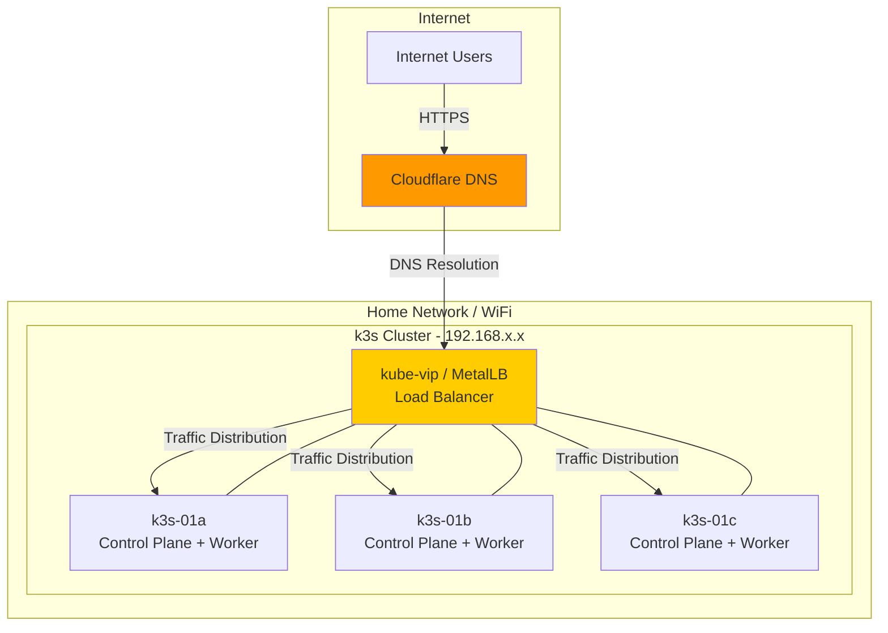

# Architecture Diagram

## System Architecture

## Component Interaction Flow

## Deployment Order

```mermaid
graph LR
    A[system-upgrade-controller] --> B[cert-manager CRDs]
    B --> C[cert-manager]
    C --> D[cert-manager-issuer]
    D --> E[dnsendpoint-crd]
    E --> F[external-dns]
    F --> G[traefik config]
    G --> H[upgrade-plans]

    style A fill:#ffcccc
    style B fill:#ffddcc
    style C fill:#ffeecc
    style D fill:#ffffcc
    style E fill:#eeffcc
    style F fill:#ccffcc
    style G fill:#ccffee
    style H fill:#cceeff
```

## Bootstrap Workflow

## Network Architecture

## Key Design Decisions

### High Availability
- **3 Server Nodes**: All nodes run both control plane and worker roles
- **Embedded etcd**: Distributed consensus across all 3 nodes (quorum-based)
- **No External Dependencies**: Self-contained cluster survives individual node failures

### Automation
- **Ansible**: Idempotent host configuration (cgroups, users, SSH)
- **k3sup**: Simplified k3s deployment with HA support
- **System Upgrade Controller**: Automated k3s and Ubuntu OS upgrades

### Certificate Management
- **cert-manager**: Automated TLS certificate lifecycle
- **Let's Encrypt**: Free, automated certificate authority
- **DNS-01 Challenge**: Works without exposing cluster to internet (via Cloudflare API)

### DNS Management
- **external-dns**: Kubernetes-native DNS synchronization
- **Cloudflare Integration**: Automatic DNS record creation/deletion for Ingresses
- **DNSEndpoint CRD**: Custom DNS records independent of Ingresses

### Resource Constraints
- **ARM64 Only**: All container images must support ARM64 architecture
- **8GB RAM per Node**: Sufficient for small-to-medium workloads
- **SD Card Storage**: Consider using USB SSD for production (I/O intensive workloads)
